⭐ If you found this project helpful, please consider giving it a star on GitHub!

# 🛍️ Full Stack E-Commerce Application (MERN Stack)

---

## 📖 Project Description

This project is a **Full Stack E-Commerce Web Application** built using the **MERN Stack (MongoDB, Express.js, React.js, Node.js)** and styled with **Tailwind CSS**. It provides a complete online shopping experience with features like product browsing, cart management, order tracking, and secure payments through **Stripe**.

Users can explore products across multiple categories, add them to their cart, and complete purchases securely.  
Admins can manage product inventory, view orders, and track revenue through an intuitive admin panel.

The **backend** handles all API operations such as authentication, product management, and payment processing.  
The **frontend** delivers a responsive and seamless user experience for both **customers** and **admins**.

🔗 **Live Demo / Repository:**  
[👉 View on GitHub](https://github.com/Amjad-Bin-Aslam/Full_Stack_E-Commerce_Website)

---

## ⚙️ Features

### 🧑‍💻 User Features
- User registration and secure login (JWT Authentication)  
- Browse and search products by category or name  
- Add or remove products from cart  
- Update quantities and view total price in real-time  
- Checkout securely using **Stripe Payment Gateway**  
- View order history and order status  

### 🛒 Admin Panel
- Add, edit, or delete products  
- Manage product categories and inventory  
- Track and manage customer orders  
- View total sales, customers, and revenue reports  
- Manage users and authentication  

---

## 🚀 Tech Stack

| Layer | Technology |
|-------|-------------|
| Frontend | React.js, Tailwind CSS |
| Backend | Node.js, Express.js |
| Database | MongoDB (Mongoose) |
| Authentication | JWT (JSON Web Token) |
| Payment Gateway | Stripe |
| Tools | Axios, React Router, React Toastify, Nodemon |

---

## 🧠 Learning Outcomes

Through building this project, I learned:
- Structuring a **full-stack MERN e-commerce system**  
- Implementing **JWT-based authentication**  
- Integrating **Stripe** for payment handling  
- Creating dynamic product filtering and search functionality  
- Building reusable components with **Tailwind CSS**  
- Designing an **admin dashboard** for order and product management  

---

## 🙏 Acknowledgment

I would like to express my sincere gratitude to **Muhammad Aqib**, my mentor, for his valuable guidance and constant encouragement during the development of this project.  
His mentorship helped me understand advanced **MERN concepts**, project structuring, and industry-level development practices.

---

## 📸 Screenshots

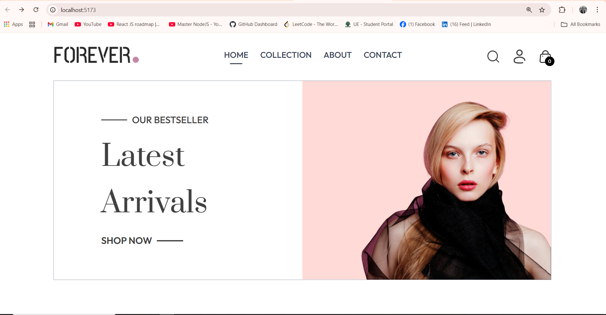
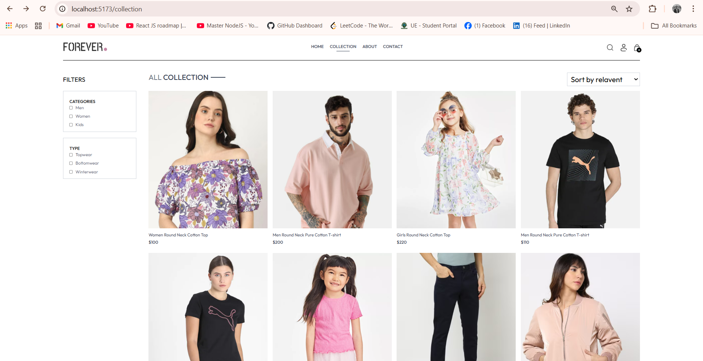
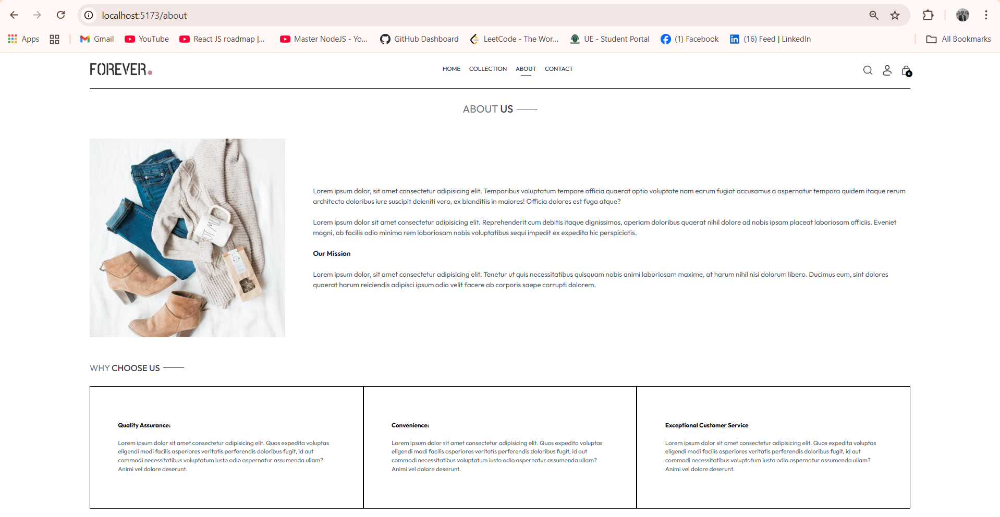
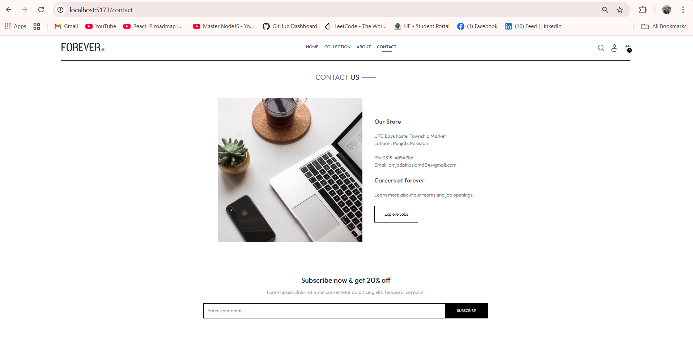
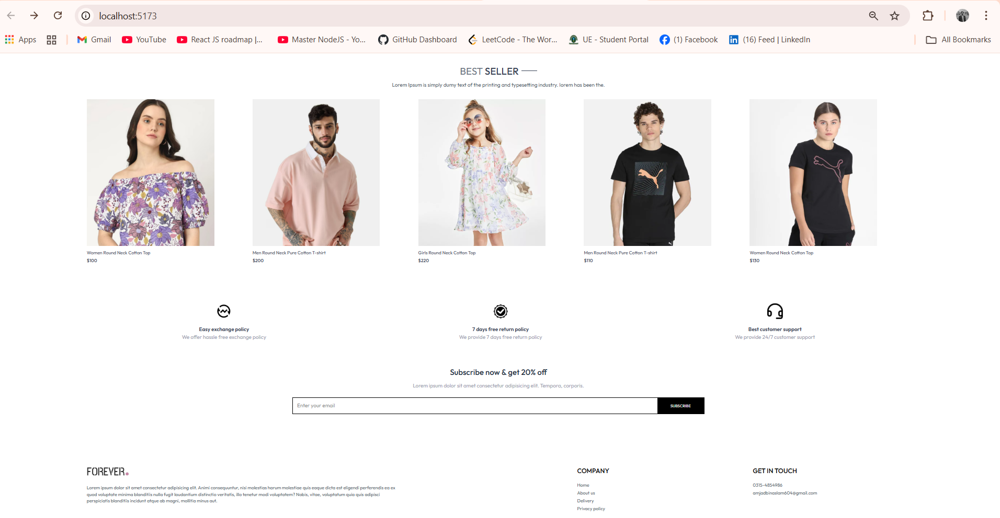
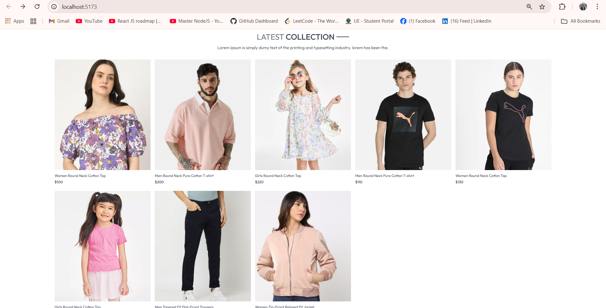
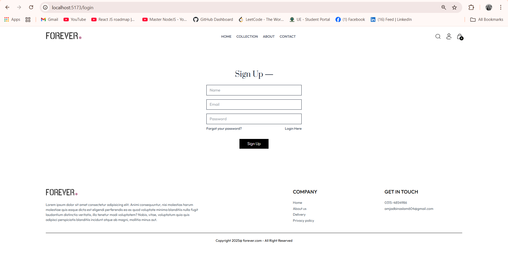
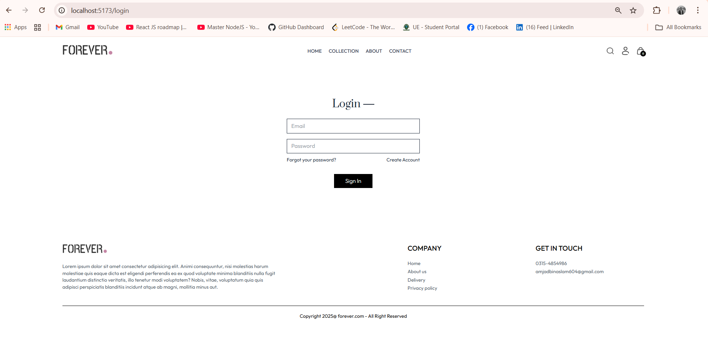
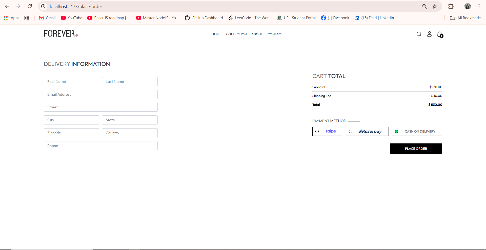
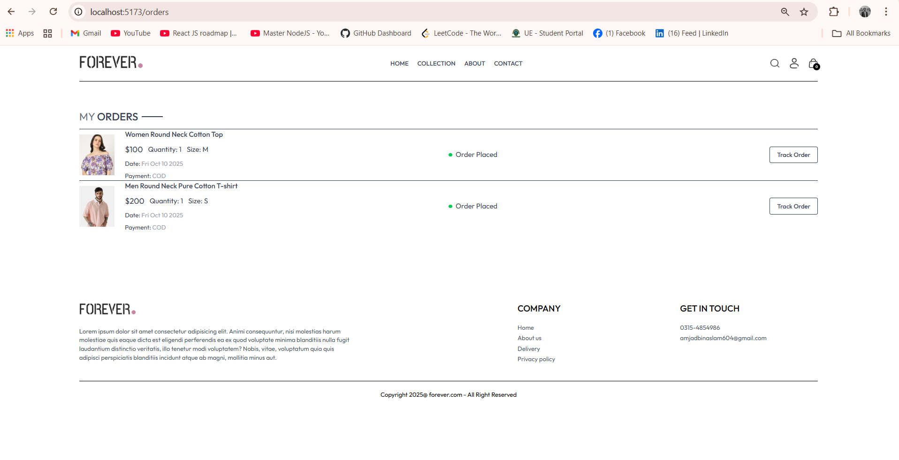
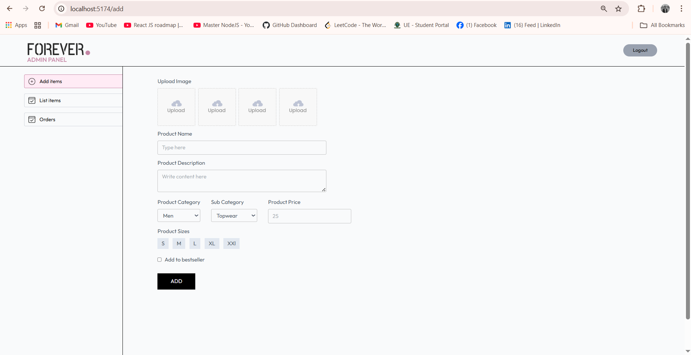
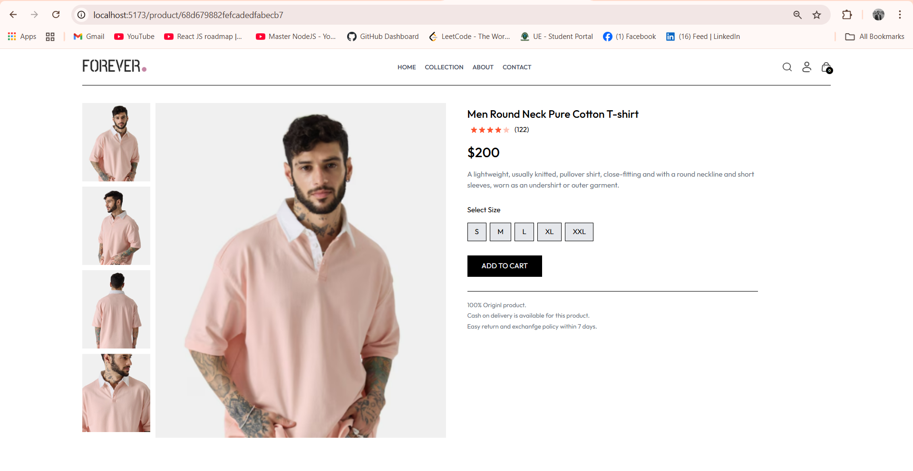
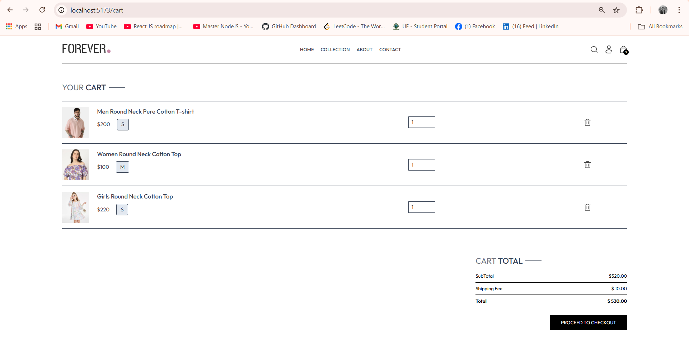
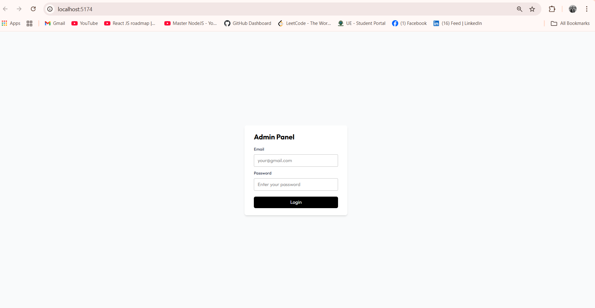
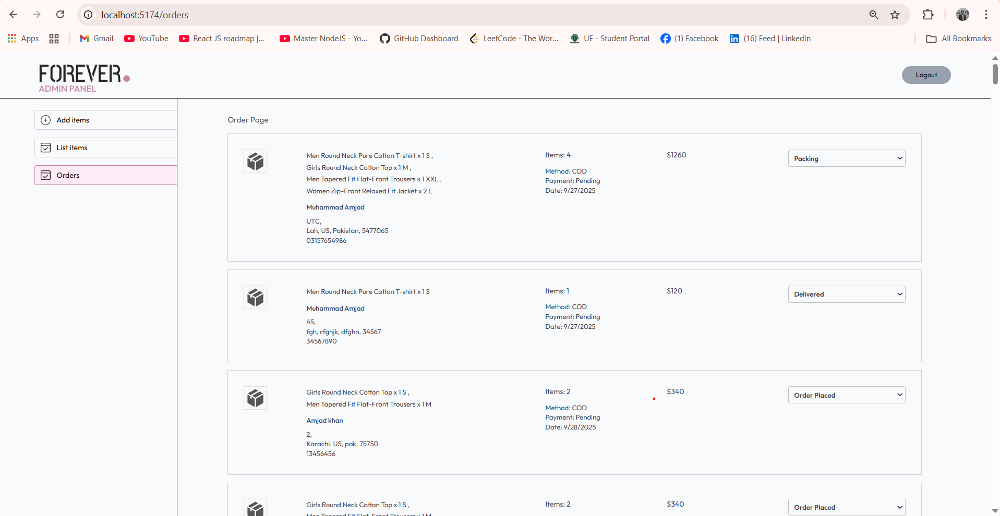
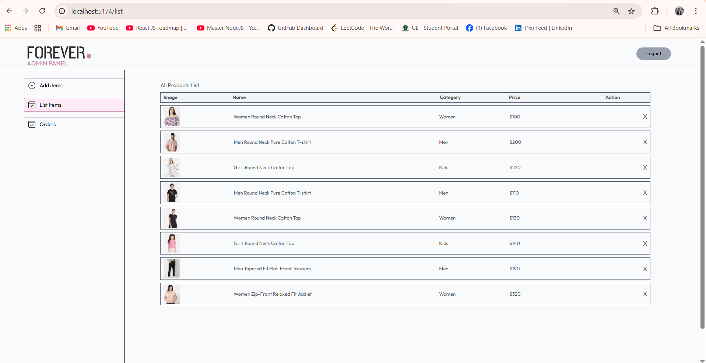

---

## Folder structure
Full_Stack_E_Commerce_Project/
│
├── backend/
│   ├── controllers/
│   ├── models/
│   ├── routes/
│   ├── server.js
│   └── .env
│
├── frontend/
│   ├── src/
│   ├── components/
│   ├── pages/
│   ├── context/
│   └── App.js
│
├── admin/
│   ├── src/
│   ├── components/
│   ├── pages/
│   ├── context/
│   └── App.js
│
└── README.md

---

## 💻 Setup Instructions
bash
# Clone the repository
git clone https://github.com/Amjad-Bin-Aslam/Full_Stack_E-Commerce_Website

# Navigate into the project folder
cd Full_Stack_E-Commerce_Website

# Install dependencies for backend
cd backend
npm install

# Start backend server
npm run dev

# Setup frontend (User)
cd ../frontend
npm install
npm run dev

# Setup admin/doctor panel
cd ../admin
npm install
npm run dev